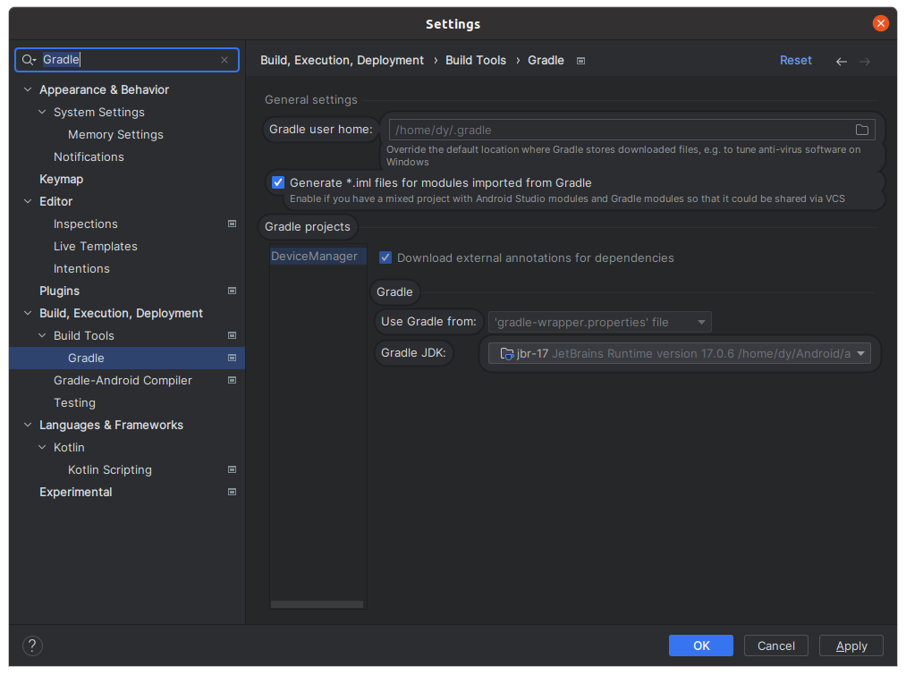

# DeviceManager

## 生成Iml文件
https://stackoverflow.com/questions/35103360/iml-file-does-not-exist-android-studio

Settings > Build, Execution, Deployment > Build Tools > Gradle > [Check] Generate *.iml files for modules imported from Gradle.



## Other
Error: listen EADDRINUSE: address already in use :::{PORT}
```shell
sudo lsof -i:{PORT}
sudo kill -9 {PID}
```